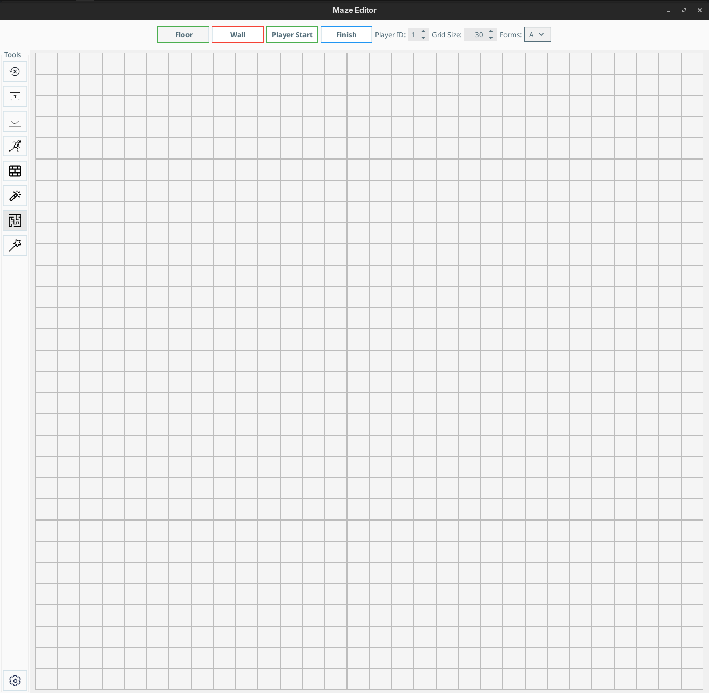
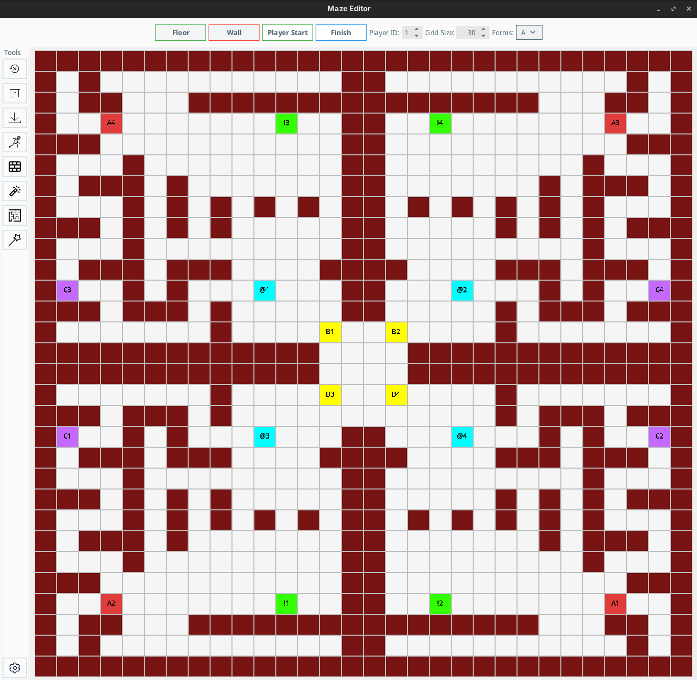

# Maze Creator

This project is a maze creator application built in Java. It allows users to create, mazes with forms collection mechanics for the Maze Runner game system.



## Generated Map Example



```json
{
  "name": "Laby",
  "forms": [
    {
      "id": "A",
      "name": "Form A"
    },
    {
      "id": "B",
      "name": "Form B"
    }
  ],
  "maze": "######################/##@2    ##@1##!1    ##/######  ##  ##  ##  ##/##      A2  A1  ##  ##/##B1##########  ##B2##/##      ##          ##/######      ##########/##      ##          ##/##  ######!2######  ##/##                  ##/######################"
}
```

## Explanation

- pid := Player ID
- The "@(pid)" indicates Spawns/Starts, the "!(pid)" indicates Finishes for the finish for each player.
- The forms are collectables that the user has to collect in an order, for example we can have A(pid) 
   that needs to be collected first after that if it exists we need to collect B(pid) ...
- There were also Sheets, but I did not figure out at this point what they do.

## How to run

### From IDE
Import the project into your Java IDE and run `MazeEditor.main()`.

### From Command Line
```bash
maven install
```

### Pre-built Release
Download the Release version and run with:
```bash
java -jar MazeCreator_1_4_1.jar
```

## Usage (GUI)

1. **Basic Editing**: Use Floor/Wall buttons for basic maze structure
2. **Player Setup**: Set Player ID and place Start (@) and Finish (!) positions
3. **Forms Placement**: Use A-Z form buttons to place collectible forms
6. **Export**: Save as JSON for use with Maze Runner game engine

## Usage (CLI)

1. **Generate Maze**: You can generate a complete maze with parameters such as forms amount maze 
size and min. steps you want your maze to be solvable in.
- forms count (default : 2)
- prefSteps (min) (default : 20)
- maze Size (default : 20)
- and output json file
- name default (CLI_Generated_Maze)
```bash
java -jar MazeCreator-1_4_2.jar --generateMaze --forms 2 --prefSteps 20  --name "Simple" --output "simple.json"
```

## Maze Format

The enhanced maze format supports:
- **Cell Types**: Floor, Wall, Start (@), Finish (!), Forms (A-Z), Sheets
- **Player Encoding**: Each element includes player ownership (1-8)
- **Sequential Forms**: Players must collect A, B, C... in exact order
- **JSON Structure**: Compatible with Maze Runner game engine